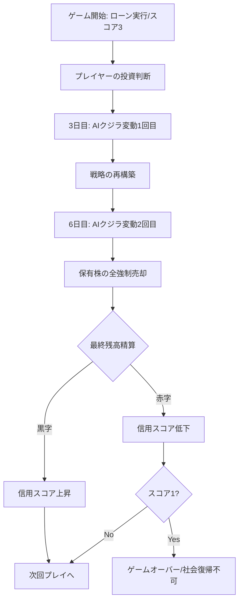
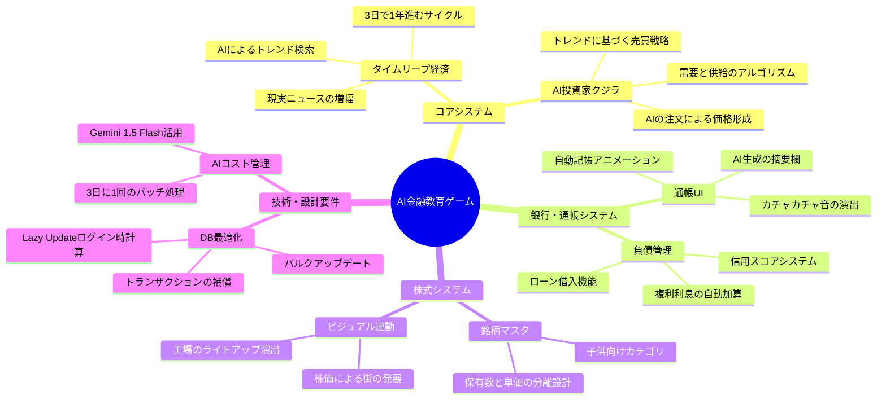

# AI連動型・次世代金融教育ゲーム 

## 1. サービス概要
生成AI（LLM）が現実世界のトレンドを解析し、3日に1回のペースでゲーム内の経済（株価・ニュース）を「加速（タイムリープ）」させて動かす、リアル連動型金融シミュレーター。

## 2. コア・コンセプト
* **タイムリープ経済**: 現実の3日間をゲーム内の「1年」として扱い、経済サイクルを高速体験させる。
* **借入スタート（レバレッジ投資）**: プレイヤーは銀行からローンを組んで投資を開始する。
* **AIクジラ（機関投資家）**: 生成AIがトレンドを元に自ら「買い注文・売り注文」を出し、市場価格を形成する。
* **信用スコアの重み**: 投資結果が「信用」に直結し、スコア1で社会復帰不可（ゲームオーバー）となる。

## 3. 主要機能要件

### A. AI経済エンジン（バッチ処理：3日に1回実行）
1. **トレンド検索**: 最新のニュース、SNSトレンド、ヒット商品をAIがブラウジング。
2. **シナリオ生成**: 抽出したトレンドを「子供がわかる経済ニュース」に要約。
3. **AI注文発行**: 各銘柄に対し、AIが「買い/売り/維持」の注文数を決定。
4. **価格決定**: 全ユーザーの注文とAIクジラの注文を合流させ、新株価を算出。
5. **通帳メッセージ作成**: 変動理由を15文字程度の「摘要欄用テキスト」として生成。

### B. 株式・投資システム
1. **銘柄マスタ**: 「お菓子」「ゲーム」「ロケット」など、子供に馴染みのあるカテゴリ。
2. **資産評価**: 「保有数 × 現在単価」によるリアルタイムな資産額表示。
3. **強制決済ロジック**: ゲーム終了条件（2サイクル終了）に基づき、全保有株を自動で売却し現金化。

### C. 銀行・信用システム（核心部）
1. **普通口座（マイナス残高対応）**:
    * 借入金（ローン）を原資とした入出金管理。
    * 精算の結果、残高がマイナス（債務超過）になる状態を許容。
2. **ローンシステム**:
    * ゲーム開始時に強制的に借入を実行。利息（複利）による負債の増加。
3. **信用スコアシステム**:
    * 10段階評価（初期値：3）。
    * サイクル終了時の損益状況に応じてスコアが変動。
    * **スコアが1になった時点でゲームオーバー（口座凍結）。**
4. **通帳機能**:
    * 自動記帳アニメーションと「カチャカチャ」という物理音の演出。

## 4. ゲームサイクル（短期決戦仕様）
本ゲームは計2回の市場変動（現実の6日間）で完結する。

1. **スタート**: 銀行からお金を借り、株を購入。
2. **1回目変動（3日目）**: AIクジラの動きにより価格変動。追撃買いや売却が可能。
3. **2回目変動（6日目）**: 最終価格決定。
4. **強制精算**: 保有株をすべて売り、ローンを返済。
5. **判定**: 最終残高に基づき信用スコアを更新。スコア1なら終了。

## 5. 技術スタック・設計要件
* **データ設計**: 通帳データはImmutable（不変）とし、履歴の積み上げで残高を算出。
* **トランザクション**: 株式売買と現金移動、スコア変動をAtomic（不可分）に処理。
* **AIコスト管理**: Gemini 1.5 Flashを採用し、3日に1回のバッチ処理で運用費を抑制。

## 6. UI/UX 要件
* **メイン画面**: 左に通帳（数字の現実）、右に街（投資の結果）を配置。
* **演出**: 残高がマイナスの際は数字が赤く点滅し、警告音が発生。
* **掲示板**: 流行の予兆についてAIや他プレイヤーと情報交換。

---

